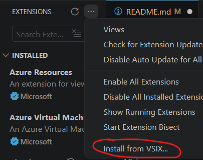
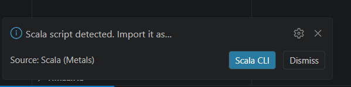

# Scala Notebook Shadow (POC)

Explores "concept 2" in this discussion / design doc https://github.com/scalameta/metals/issues/4434, of emitting the Notebooks as a script. 

Conclusion: Moderately successful (I'm using it) - LSP support, but with some warts that are a consequence of the design. 

## Concept

This is a VSCode extension which plugs into the Notebook cell LSP triggers and emits the notebook as a .sc script. 

This triggers metals to fire up it's secondary scala-cli "orphan script" BSP server.

** The user must accept to import this script manually ** 

After this point, the extension 
- acts as a proxy server to metals
- forwarding LSP requests to the (officialy supported) scala-cli scripts 
- Doing some number line bookkeeping to emit the responses back into the notebook

## Features

LSP support. 

LSP features either work (or are implementable). Working; 

- Semantic Token highlighting
- Go to definition
- Type inference
- Insert inferred type
- Inlay Type hints
- Range expansion

## Try it

Install almond. 

```sh
cs launch --use-bootstrap almond:0.14.5 --scala 3.8.0 -- --install --force
```

Download the VSIX file from the latest release; 

https://github.com/Quafadas/Almond_Mill_Experiment/releases/latest

And add it to your VS Code extensions.


Create a *.ipynb notebook in the project. Open it and Select the scala kernel. 

You _may_ need to reload the window, in order for the extension to fire and pick up the workbook.

## Known Warts

### Code structure

The underlying mechanism emits `.sc` files which attempt to follow following almond's cell wrapping methodolgy. There's no proof this is complete or accurate, and errors can surface in the form of imports / given resolution for different scopes.

We need to re-write certain ammonite synatx (e.g. `import $cp.resources`) to directive syntax for scala-cli which may lead to another class of errors.

In general, the "compilation" is proxied by a script which is not actually guaranteed to be what you are compiling, and this leads to a long tail of issues. 

`import $file.MyFunction` for example, is not implemented / supported at the moment, so it will run but not "compile" (!) according to the LSP support provided here.

### Doesn't import

The concept relies on metals auto-detecting and importing orphaned scala-cli scripts. 



If this mechanism has been disabled, or is not firing, or you do not accept it, then this extension will not work. You are offered the opportunity to automatically import such scripts - for this extension this is recommended.

### Repository Pollution

Your repository will be polluted with a "notebook-shadow" directory, where this extension write outs the temporary *.sc files in order to have metals activate it's LSP capabilities. Mitigate as follows; 

- in gitignore, add `notebook-shadow` to ignore the temporary files. 
- in .vscode/settings.json, add the following
```json
  "files.exclude": {
    "notebook-shadow": true
  }
```
to exclude files from the file explorer. 

Finally, errors are "double reported", for both the script and notebook. To silence them, add 

`!notebook-shadow/*.sc`

to the problem filter.

### Ghost warnings

Many scripts will emit warnings which assume they are relevant in the full project context. e.g.

```
[outside cell] Using directives detected in multiple files. It is recommended to keep them centralized in the /home/simon.parten/scripting/project.scala file.
```

which pollute the Problems tab.

### Scala Version
The Juypter Kernel has a scala version that it uses. 

The scala-notebook shadown has a scala version that it uses. 

These must be kept in sync by the user - if they don't match, there may be hard to diagnose mismatches between compile / runtime behaviour.
